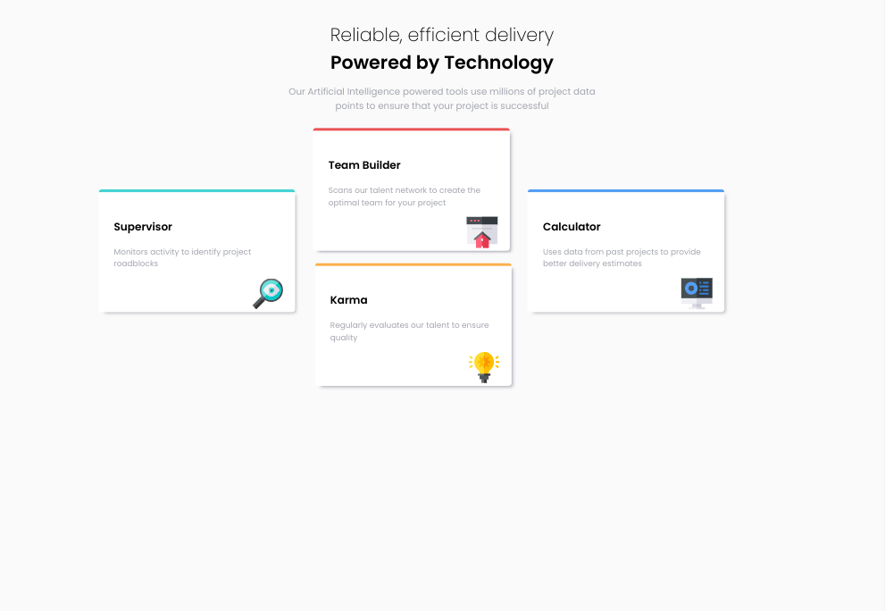
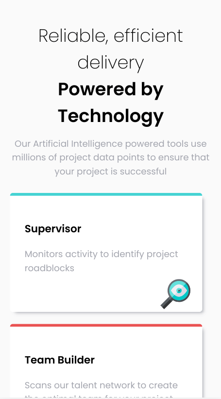

# Frontend Mentor - Four card feature section solution

This is a solution to the [Four card feature section challenge on Frontend Mentor](https://www.frontendmentor.io/challenges/four-card-feature-section-weK1eFYK). Frontend Mentor challenges help you improve your coding skills by building realistic projects. 

## Table of contents

- [Overview](#overview)
  - [The challenge](#the-challenge)
  - [Screenshot](#screenshot)
  - [Links](#links)
- [My process](#my-process)
  - [Built with](#built-with)
  - [What I learned](#what-i-learned)
  - [Continued development](#continued-development)
  - [Useful resources](#useful-resources)

## Overview

### The challenge

Users should be able to:

- View the optimal layout for the site depending on their device's screen size

### Screenshot

### Links

- Live Site URL: [Github Pages](https://jdegand.github.io/four-card-feature-section/)

## My process

### Built with

- CSS custom properties

### What I learned

### Continued development

- Semantic HTML5 markup
- Flex / Grid Implementation

### Useful resources

- [MDN Docs](https://developer.mozilla.org/en-US/docs/Web/CSS/:nth-child) - :nth-child
